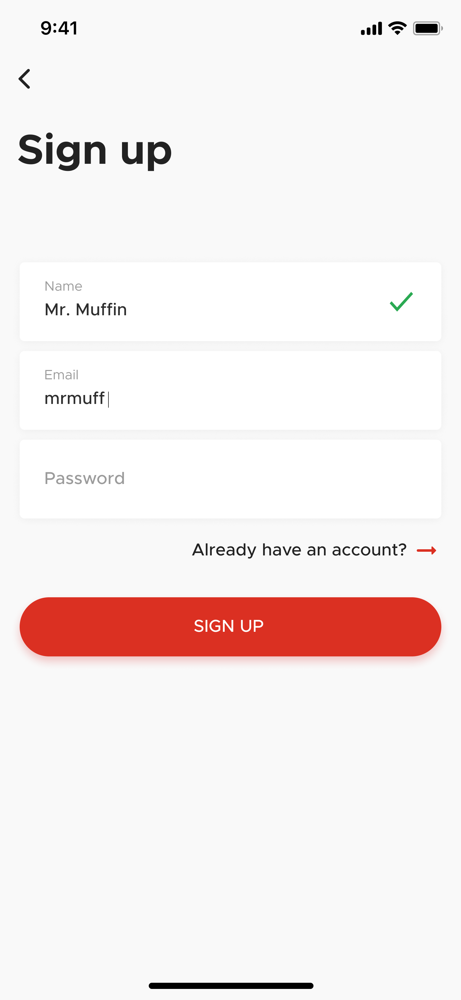
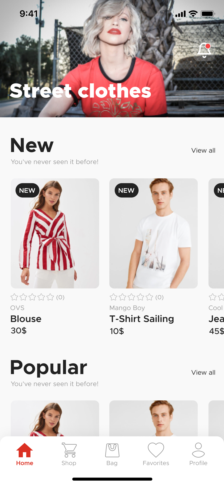

# blanja-native-app

Blanja native app is mobile app (android) version of Blanja e-commerce itself, this project was built with React native as frontend.

## Installation

Use the package manager [npm](https://www.npmjs.com/get-npm) to install all required dependecies.
```bash
npm install
```

## Requirements for Development 
- [`Blanja Backend`](https://github.com/handa26/products-api)

## Usage

First add .env files on root project and add following variables:
```bash
API_URL_DEVELOPMENT=http://yourIpAddress:3000/
IP_DEVELOPMENT=yourIpAddress
```
examples:
```bash
API_URL_DEVELOPMENT=http://192.168.8.101:3000/
IP_DEVELOPMENT=192.168.8.101
```

Assuming android emulator was running or connected with device, run:
```bash
npm run android
```
`npm run android` will install/build apk development to your emulator or device, if you
modify some files inside android folder simply `run android` again.

Start development with:
```bash
npm run start
```

## Screenshots

<div align="center">
  
  
</div>


## Related Project

Blanja web (ReactJS)
- [`Blanja`](https://github.com/handa26/blanja-frontend)

RESTful API for this project.

<a href="https://github.com/handa26/products-api">

</a>